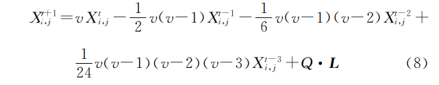

# 1、算法原理
建立麻雀搜索算法的数学模型，主要规则如下所述：
* 发现者通常拥有较高的能源储备并且在整个种群中负责搜索到具有丰富食物的区域，为所有的加入者提供觅食的区域和方向。在模型建立中能量储备的高低取决于麻雀个体所对应的适应度值(Fitness Value)的好坏。
* 一旦麻雀发现了捕食者，个体开始发出鸣叫作为报警信号。当报警值大于安全值时，发现者会将加入者带到其它安全区域进行觅食。
* 发现者和加入者的身份是动态变化的。只要能够寻找到更好的食物来源，每只麻雀都可以成为发现者，但是发现者和加入者所占整个种群数量的比重是不变的。也就是说，有一只麻雀变成发现者必然有另一只麻雀变成加入者。
* 加入者的能量越低，它们在整个种群中所处的觅食位置就越差。一些饥肠辘辘的加入者更有可能飞往其它地方觅食，以获得更多的能量。
* 在觅食过程中，加入者总是能够搜索到提供最好食物的发现者，然后从最好的食物中获取食物或者在该发现者周围觅食。与此同时，一些加入者为了增加自己的捕食率可能会不断地监控发现者进而去争夺食物资源。
* 当意识到危险时，群体边缘的麻雀会迅速向安全区域移动，以获得更好的位置，位于种群中间的麻雀则会随机走动，以靠近其它麻雀。
# 2.具体公式
1. 在麻雀搜索中，适应度值较好的发现者在搜索过程中会优先找到食物。因为整个麻雀种群都是根据发现者所给的信息来获取食物的位置，所以发现者有更大的觅食范围。在每次迭代过程中，发现者的位置更新描述如下：

ｔ为当前迭代数；iter~max~为最大的迭代次数；Ｘ~ｉ，ｊ~表示第ｉ个麻雀在第ｊ 维中的位置信息；α是 一 个 随 机 数，且α∈（０，１］；Ｒ~２~和Ｓ~Ｔ~ 分别表示预警值 和 安 全 值，且 Ｒ~２~ ∈［０，１］，ＳＴ∈［０．５，１］；Ｑ 是服从正态分布的随机数；Ｌ 是 一 个 １×ｄ 的 矩
阵，且该矩阵中的每个元素全为１。当Ｒ~２~ ＜ＳＴ 时，表 示觅食环境中没有捕食者，发现者可执行更大范围的搜索行为；当Ｒ~2~≥ＳＴ 时，表示种群中的一些麻雀已经发现了捕食者，并向种群中其他 麻雀发出警报，此时所有麻雀都需要迅速飞到安全的地方进行觅食。
2. 在觅食过程中，一些加入者会随时监视着发现者，它们会和发现者争夺食物或者在发现者周围觅食。因此，加入者的位置更新描述如下：

其中，ＸＰ为目前发现者所处的最优位置；Ｘ~worst~为当前全局最差的位置；Ａ是一个１×ｄ 的矩阵,该矩阵中的每个元素随机赋值为１或－１，且Ａ^＋^ ＝Ａ^Ｔ^（ＡＡ^Ｔ^）^－１^。当ｉ＞ｎ／２时，则表示第ｉ个加入者没有获得食物，处于十分饥饿的状态，当 前 适 应 度值较低，需要飞往其他地方觅食，以获得更多能量。
3. 麻雀种群在整个觅食过程中会受到捕食者的威胁，因此，会做出反捕食行为，其数学表达式如下：
  
其中，Ｘ~best~为当前全局最优位置；β为步长控制参数，且是一个服从均值为０、方差为１ 的正态分布随机数；Ｋ 是麻雀移动的方向，且 Ｋ∈［－１，１］；ｆ~ｉ~为当前麻雀个体的适应度值；ｆ~ｇ~和ｆ~ｗ~分别表示当前全局最优和最差的适应度值；ε为最小常数，以避免分母为０。当ｆｉ＞ｆｇ时，说明麻雀正处于种群边缘，极易受到
捕食者的攻击；当ｆ~ｉ~＝ｆ~ｇ~时，说明处于种群中间的麻雀意识到了危险，需要靠近其他麻雀来尽量减少它们被捕食的风险。
# 3.分数阶优化
使用的定义是==Grumwald－Letniko==（Ｇ－Ｌ定义）
 
$ｖ$为阶次；$Ｔ$ 为周期；$\gamma(z)=\int_0^\infty {{t}^{z-1}{e}^{-t}} {\rm d}x=(n-1)!$  为 伽马函数；$β$为截止阶次。
令式（４）中的$β$＝４，可得:
 
由式（５）可知，分数阶导数结果与当前项和之前的状态值均有关，且过去事件的影响随着时间的推移而减小。将 分 数阶引入到麻雀搜索算法中发现者的位置更新处。由 式（１）可知，当种群中的一些麻雀已经发现了捕食者，并向种群中其他麻雀发出警报时，发现者的位置更新可描述为：
 
式（６）的左边为分数阶$Ｇ－Ｌ$定义阶次$ｖ$为１且周期Ｔ为１时的离散形式，即：
 
由式（５）可知，当种群中的一些麻雀已经发现了捕食者，并向种群中其他麻雀发出警报时，发现者的位置 更新可表示为：
 
可以看出，分数阶次影响着发现者的位置更新。因此，本文采用自适应调整机制，引入进化因 子$ｆ$对分数阶阶次ｖ进行修正。
(1). 当种群中的一些麻雀已经发现了捕食者，并向种群中其他麻雀发出警报时，发现者$ｉ$到其他麻雀的平均距离为：
 
(2). 在进化过程中，进化 因 子$ｆ$决定加入者当前的状态，其定义为：

其中，ｄｇ为全局最优位置到其他麻雀的平均距离；ｄ~max~和ｄ~min~
分别为所有ｄ~ix~中的最大值和最小值。

(3). 当分数 阶 阶 次ｖ∈［０．５，０．８］时，收 敛 速 度 更 快。因此，ｖ（ｆ）＝ 12e^－0.47ｆ^ ∈［0.5，0.8］。